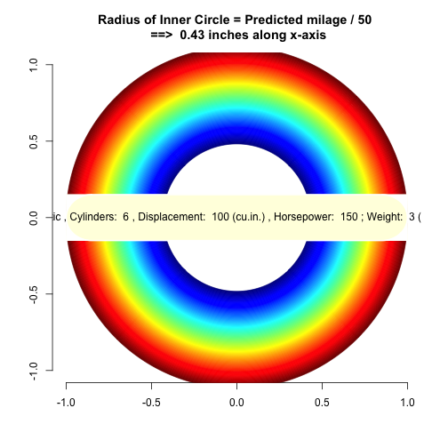

Predicting Mileage of a Vehicle
========================================================
author: Ijaz Ahmad
date: "16 August 2015"
transition: rotate
width: 1440
height: 900

Introduction
========================================================

- This application predicts mileage per gallon of a vehicle with some features of user's choice. The prediction model depends on the observations of 'mtcars' data set. Any change in the  features selected by the user results in prediction of a different mileage of the vehicle.
- The application displays a sidebar panel with options to select different parameters of selected features/variables (i) Transmission Type, (ii) Number of Cylinders, (iii) Displacement, (iv) Gross Horsepower and (v) Weight.
- Each feature constitutes a set or range of values to be selected by the user.
- The reactive input panel conveys the set of selected values of the features to the prediction model for prediction of the mileage per gallon.
- The predicted mileage is displayed in figures and a circle is drawn with its inner radius equivalent to the predicted mileage.


Deciding Basics - Building our model
========================================================

- There are a lot of data sets available in R and on net to proceed with developing a prediction application. To make the package simple, I chose 'mtcars' data set and decided to build a mileage prediction model with maximum possible accuracy.
- Being a small data set of just 32 observations, it is not possible to build an accurate prediction model. The out-of-sample error rate would be higher.

```r
## Load data
library(datasets); data("mtcars")
## Simple regression model
mod.simple <- lm(mpg ~ ., mtcars)
## Best model
mod.fit <- lm(mpg ~ am + log(wt) + log(cyl * disp * hp), mtcars)
```

Features of our model
========================================================

- The simplest regression model 'mod.simple <- lm(mpg ~ ., mtcars)' covers 87% of the data variance while the Residual Standard Error of the model is 2.65.
- Instead of selecting all the variables as predictors, I have just selected 'am' as the main predictor and four other variables as covariates which cover most of the data variance i.e. number of cylinders (cyl), displacement (disp), gross horsepower (hp) and weight (wt).
- In order to control the interdependence and non-linearity of the selected covariates, I have built a model which takes log of weight and log of intersection of the remaining covariates i.e mod.fit <- lm(mpg ~ am + log(wt) + log(cyl * disp * hp), mtcars). This model covers 89% variance of data while the Residual Standard Error of the model has gone down from 2.65 to 2.15.

Output with default input values of features
========================================================


```
21.6 miles per gallon
```

<!--html_preserve--><h1></h1><!--/html_preserve--> 
